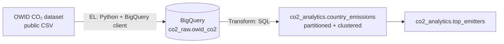

# ☁️ CO₂ Cloud Analytics — BigQuery Pipeline

[](https://github.com/ibrahim-yeryaran/bigquery-co2-pipeline/actions/workflows/ci.yml)

A **cloud data pipeline** that loads the global CO₂ emissions dataset into
**Google BigQuery** and transforms it into a partitioned, clustered analytics
layer with SQL — demonstrating cloud-warehouse engineering on a real, free,
no-credit-card setup (**BigQuery sandbox**).

---

## 🏗️ Architecture



**Flow:** Python downloads the public CSV and loads it into a BigQuery **raw**
dataset → SQL transformations build a clean, partitioned/clustered **analytics**
layer.

---

## 🧰 Tech Stack

| Layer            | Technology                              |
| ---------------- | --------------------------------------- |
| Cloud warehouse  | **Google BigQuery** (sandbox — free)    |
| Extract / Load   | Python + `google-cloud-bigquery`        |
| Transformation   | BigQuery Standard SQL                    |
| Data source      | [Our World in Data — CO₂](https://github.com/owid/co2-data) (public) |
| Config / secrets | `.env` + Application Default Credentials |

---

## 📁 Project Structure

```
bigquery-co2-pipeline/
├── extract_load/
│   └── load_to_bigquery.py        # CSV → BigQuery raw table (idempotent load)
├── transform/
│   ├── 01_country_emissions.sql   # clean country-year table (partition + cluster)
│   ├── 02_top_emitters.sql        # per-year rankings
│   └── run_transformations.py     # runs the SQL files in order
├── requirements.txt
├── .env.example
└── .gitignore                     # *.json + .env never committed
```

---

## 🔧 Setup (one-time, free)

### 1. Create a GCP project with BigQuery sandbox
- Go to the [Google Cloud Console](https://console.cloud.google.com), create a project.
- Open **BigQuery** — the **sandbox** activates automatically (no credit card,
  10 GB storage + 1 TB query/month free).

### 2. Authenticate (no key file needed)
```bash
gcloud auth application-default login
```
> Prefer Application Default Credentials over a downloaded service-account key —
> nothing secret ends up on disk or at risk of being committed.

### 3. Configure
```bash
cp .env.example .env       # then set GCP_PROJECT_ID
python -m venv .venv && source .venv/bin/activate
pip install -r requirements.txt
```

---

## 🚀 Run

```bash
# 1) Extract + Load: public CSV → BigQuery raw table
python extract_load/load_to_bigquery.py

# 2) Transform: build the analytics layer in BigQuery
python transform/run_transformations.py
```

---

## 🗄️ Data Model

**`co2_raw.owid_co2`** — raw load of the OWID CSV (~50k rows, autodetected schema).

**`co2_analytics.country_emissions`** — clean country-year table
(`PARTITION BY year`, `CLUSTER BY country`):

| Column            | Description                       |
| ----------------- | --------------------------------- |
| `country`, `iso_code`, `year` | dimensions            |
| `population`, `gdp`, `gdp_per_capita` | context       |
| `co2`             | total emissions (Mt)              |
| `co2_per_capita`  | per-capita emissions (t)          |
| `share_global_co2`| share of global emissions (%)     |

**`co2_analytics.top_emitters`** — per-year rankings by total and per-capita CO₂.

---

## 🧠 Cloud Design Decisions

- **BigQuery sandbox** — real cloud warehouse, zero cost, no credit card.
- **`PARTITION BY year`** — queries scan only the relevant year partitions →
  less data scanned = lower cost and faster results.
- **`CLUSTER BY country`** — country-filtered queries read fewer blocks.
- **Aggregate rows excluded** (`LENGTH(iso_code) = 3`) — "World"/continent rows are
  dropped so country analytics aren't double-counted.
- **Secrets never committed** — `.gitignore` blocks `*.json` keys and `.env`;
  auth uses Application Default Credentials.
- **Idempotent** — `WRITE_TRUNCATE` load and `CREATE OR REPLACE` transforms can be
  re-run safely.

---

## 📊 Example Queries

```sql
-- Top 10 emitters in the most recent year
SELECT country, co2, co2_per_capita
FROM `PROJECT.co2_analytics.top_emitters`
WHERE year = (SELECT MAX(year) FROM `PROJECT.co2_analytics.top_emitters`)
  AND rank_total_co2 <= 10
ORDER BY rank_total_co2;

-- Turkey's emission trend since 1990
SELECT year, co2, co2_per_capita
FROM `PROJECT.co2_analytics.country_emissions`
WHERE iso_code = 'TUR' AND year >= 1990
ORDER BY year;
```

---

## 🛣️ Possible Extensions

- Orchestrate the load + transforms with **Airflow** or **Cloud Composer**.
- Replace the SQL runner with **dbt-bigquery** for tests + lineage.
- Schedule incremental loads and add **BigQuery scheduled queries**.
- Build a **Looker Studio** dashboard on top of the analytics layer.

---

## 📄 License

MIT — feel free to use this as a learning reference.
